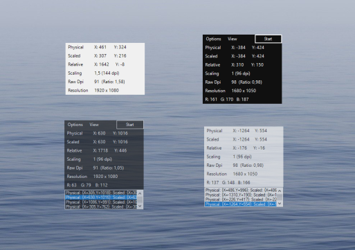

# MPos - Mouse Position Tracker

> Mouse position tracker and DPI information for Windows 10

MPos is a minimalistic and easy to use tool to track the current position of the
cursor on the screen. MPos especially considers High-DPI monitors and DPI scaling
of Windows 10. The tracked cursor position is provided in physical/ unscaled Windows
pixels and in coordinates scaled by DPI-virtualization. The tool also provides information
about the DPI scaling and the raw/ physical DPI of the current monitor.

## Features

- Track the cursor position in physical pixels (*Physical*) and scaled pixels (*Scaled*)

- See the cursor position relative to the active window (*Relative*)

- See the DPI scaling of the current monitor (*Scaling*)

- See the raw (real) DPI of the current monitor (*Raw Dpi*)

- Determine the color of the pixel at the cursor position (*RGB*)

- Flexibly adjust shown data

- Grab the current cursor position with global shortcut

- Log of last grabbed cursor positions for easy copying

- Set opacity and dark mode

- Fully portable with no installation needed

## Setup and Usage

#### Requirements

MPos requires **Windows 8.1 or newer** and **.NET Framework 4.6** or newer.
MPos does not support Windows versions prior to 8.1 because its DPI scaling
related features depend on API methods introduced with this version.

## Version History

Read [the changelog](https://github.com/bluegrams/MPos/blob/master/Changelog.md) to see changes in each version.

## Feedback and Support

_Please leave a feedback on [Sourceforge](https://sourceforge.net/p/mpos/reviews) or on [AlternativeTo](https://alternativeto.net/software/mpos--mouse-position/). Thank you!_

Places to get help:

- Ask on [Sourceforge](https://sourceforge.net/p/mpos/discussion/) (General help, ideas etc.)
- Open an issue on [GitHub](https://github.com/bluegrams/MPos/issues) (Bugs, feature requests etc.)

## Contributing

You are welcome to contribute by opening a [pull request on GitHub](https://github.com/bluegrams/MPos/pulls).

## License

This software is published under [BSD-3-Clause license](LICENSE.txt) by Bluegrams.
